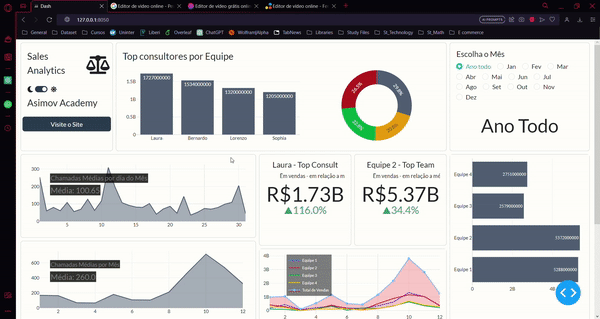

# Sales Analysis Dash

Dashboard for analyzing metrics and sales of a call center made wih Python.

<h1 align="left">
  
</h1>

### Technologies
> - Dash
> - Dash-Core-Components
> - Dash HTML
> - Dash Bootstrap
> - Plotly
> - Pandas

### Requirements
- dash==2.3.1
- dash-auth==1.4.1
- dash-bootstrap-components==1.1.0
- dash-bootstrap-templates==1.0.5
- gunicorn==20.1.0
- pandas==1.4.2
- plotly==5.8.0

## Credits
This project belongs to Asimov Academy, the plataform link in the button below:

   
